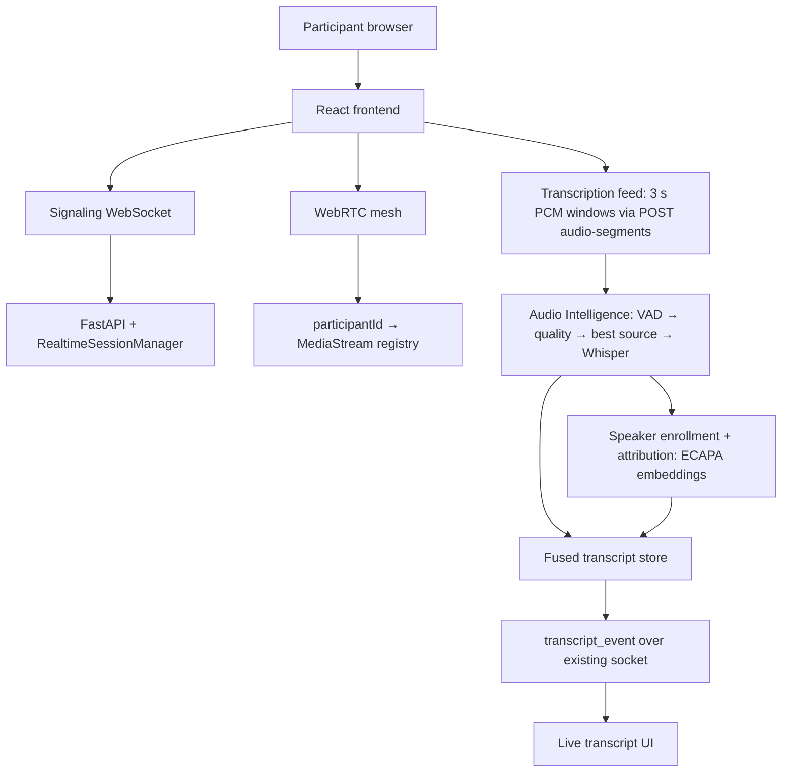

# Roundtable

> **"Every phone hears. Roundtable understands."**

Roundtable turns the smartphones already sitting around a table into one
cooperative microphone system: every participant's phone captures audio,
the phones exchange it over WebRTC, and a backend AI pipeline produces a
single **live, speaker-attributed transcript** of the real-world conversation.

The core idea: **one far-field microphone is never enough** (distance,
café noise, overlapping speech defeat it). N close microphones — one per
person — give the system a separate, high-SNR view of every speaker, so it
can pick the clearest source per moment and know *who said what* without any
special hardware.

---

## Table of contents

- [How it works (end to end)](#how-it-works-end-to-end)
- [Architecture](#architecture)
- [Key features](#key-features)
- [Repository layout](#repository-layout)
- [Frontend](#frontend)
- [Backend](#backend)
- [Audio-intelligence pipeline](#audio-intelligence-pipeline)
- [Speaker enrollment & attribution](#speaker-enrollment--attribution)
- [WebRTC transport](#webrtc-transport)
- [REST + WebSocket API reference](#rest--websocket-api-reference)
- [Configuration](#configuration)
- [Run locally](#run-locally)
- [Remote testing (ngrok)](#remote-testing-ngrok)
- [Tests](#tests)
- [Current status: implemented vs planned](#current-status-implemented-vs-planned)

---

## How it works, end to end

1. **Host creates a session** (`/create-session` → `POST /api/sessions`) and
   lands in the **host lobby** (`/host-lobby`) with a QR code / invitation link.
2. **Participants join** by scanning the QR (`/join/:token`): they enter a
   display name, the host approves them from the lobby, and each approved
   participant receives a short-lived `participantId` + `participantToken`
   (stored only in tab-scoped `sessionStorage`).
3. **Microphone setup** (`/microphone-setup`): permission → device picker →
   4-second mic test → **30-second voice enrollment** → seating position →
   ready. The `Ready` button stays disabled until mic test *and* enrollment pass.
4. **Live session** (`/roundtable`): the browser opens the signaling WebSocket,
   captures the mic, and negotiates a **WebRTC mesh** — every pair of
   participants gets its own `RTCPeerConnection`, so everyone hears everyone.
5. **Transcription feed**: each client continuously captures its *own* mic to
   rolling 3-second PCM windows and `POST`s them to
   `/api/sessions/{id}/audio-segments` (results come back over the existing
   socket — raw audio never touches signaling).
6. **Audio intelligence** (backend, per participant stream, never mixed):
   Silero VAD → quality scoring → best-source selection → faster-whisper
   (English) → duplicate suppression → speaker attribution → fused transcript.
7. **Live transcript UI** shows `[MM:SS] Name — "text"`, updating partial
   rows in place and finalizing them when speech stops.
8. **Meeting end**: leaving closes sockets/peers and stops mic tracks;
   removing a participant deletes their speaker profile; nothing is recorded
   permanently (the store is in-memory).

---

## Architecture



Key design decisions, all deliberate:

- **Audio transport is WebRTC peer-to-peer.** The server only *signals*
  (SDP offer/answer/ICE via `peer_signal` messages). The server never hears,
  mixes, or stores call audio.
- **Transcription input is per-device HTTP upload**, not the WebRTC audio:
  each phone sends its *own* microphone to the pipeline, preserving the
  `participantId → stream` identity end to end.
- **The backend is stateless-ish**: one in-memory `InMemorySessionStore`
  (sessions, invitations, participants, speaker profiles). No database.
  Restarting the server wipes everything by design.

---

## Key features

### Multi-user sessions with host approval
- **What:** a host creates a named session (capacity 2–100); participants join
  via QR/invitation link and wait for host approval.
- **Why:** ad-hoc real meetings need zero-account onboarding with a human
  gatekeeper.
- **How:** `SessionCreation.tsx` → `POST /api/sessions` → host creds in
  `sessionStorage` (`roundtable.hostSession`); `HostLobby.tsx` polls the
  lobby every 5 s and approves/rejects; `JoinSession.tsx` runs an explicit
  state machine (`checking → ready → requesting → waiting → approved`,
  plus `invalid/expired/full/locked/ended/rejected/error`) and polls approval
  every 3 s.
- **Used:** React 19, React Router 7, FastAPI, Pydantic.

### Cooperative microphone capture + live check
- **What:** per-device mic permission, device picker, 4-second level test,
  optional seating position.
- **How:** single `getUserMedia` helper (`src/lib/audio.ts`) with echo
  cancellation / noise suppression / AGC; `AnalyserNode` level meter;
  `sender.replaceTrack()` switching without renegotiation.
- **Used:** Web Audio API, MediaDevices API.

### 30-second speaker enrollment
- **What:** after the mic test, each participant records ~30 s of natural
  speech (countdown, progress bar, live level, speech indicator, early stop).
- **Why:** a per-session voice profile lets the system verify *who* is
  speaking instead of trusting which phone captured the audio.
- **How:** `VoiceEnrollment.tsx` records with `MediaRecorder` and uploads
  multipart `POST /api/sessions/{id}/speaker-enrollment`; the backend runs
  Silero VAD, keeps ≥1 s regions (max 12), embeds each with ECAPA-TDNN,
  averages them, gates on ≥10 s speech / SNR / clipping, and stores only the
  192-dim embedding — the raw recording is never persisted.
- **Used:** MediaRecorder, SpeechBrain ECAPA (`spkrec-ecapa-voxceleb`), Silero VAD.

### WebRTC mesh with TURN fallback
- **What:** every participant pair negotiates an audio-only peer connection;
  one hidden `<audio>` element per remote peer plays their stream.
- **How:** `useSessionAudio.ts` — offerer elected by id comparison
  (`localeCompare`), trickle ICE, buffered candidates until remote
  description, `ontrack` → `event.streams[0]` registered under that peer's id.
  ICE servers: Google STUN always, plus TURN from `VITE_TURN_URLS` /
  `VITE_TURN_USERNAME` / `VITE_TURN_CREDENTIAL` when direct P2P fails.
  Per-candidate-type (`host/srflx/relay`) and selected-pair logging included.
- **Used:** native `RTCPeerConnection`, no WebRTC library.

### Live transcription (English)
- **What:** rolling captions appear ~2–3 s after speech, then finalize.
- **How:** `transcriptionFeed.ts` captures the local mic through an inline
  AudioWorklet (downsamples to 16 kHz mono, posts 0.1 s chunks, accumulates
  3 s windows, skips digital silence) and POSTs base64 PCM; the backend
  transcribes winners only and broadcasts `transcript_event`; the UI upserts
  rows by id (partials update in place, pulsing dot until `isFinal`).
- **Used:** AudioWorklet, faster-whisper `small` (`beam_size=3`,
  `temperature=0`, `language="en"`, model loaded once at startup).

### Speaker-attributed transcript
- **What:** every caption carries the verified speaker (`Rahul`, `Priya`,
  `Unknown`, `Multiple speakers`) — never a raw id, never `Speaker 1/2/3`.
- **How:** device stream is the prior, ECAPA cosine similarity verifies
  (accept ≥0.60, weak ≥0.50, mismatch → `unknown`, close cross-match →
  `multiple`), `VoiceHysteresis` requires repeated evidence before switching,
  `TemporalVoter` keeps continuity, fusion merges same-speaker fragments.
- **Used:** SpeechBrain ECAPA, NumPy; pyannote intentionally **not** used
  (optional stub interface in `diarization.py` only).

---

## Repository layout

```
BNB/
├── src/                        # React 19 + TS + Tailwind v4 frontend
│   ├── pages/                  # Route components (see table below)
│   ├── components/             # Landing sections + mic/* setup widgets
│   ├── lib/                    # api.ts, audio.ts, participantAudio.ts,
│   │                           # transcriptionFeed.ts, useSessionAudio.ts, ...
│   ├── App.tsx                 # All routes (see Frontend)
│   └── main.tsx                # StrictMode entry
├── backend/                    # FastAPI backend (Python 3.11)
│   ├── main.py                 # App, CORS, lifespan warmup, routers, /ws, /health
│   ├── routes/                 # sessions, invitations, participants,
│   │                           # intelligence, speaker
│   ├── realtime.py             # WS signaling: presence, peer_signal relay
│   ├── store.py                # In-memory session repository
│   ├── room_manager.py         # Legacy energy prototype (unused by app)
│   ├── audio_intelligence/     # VAD → quality → selection → Whisper →
│   │                           # dedupe → attribution → fusion → pipeline
│   ├── speaker/                # ECAPA embeddings, profiles, enrollment,
│   │                           # voice attribution + hysteresis
│   └── requirements.txt
├── scripts/                    # test_part2.py, test_speaker.py
├── public/                     # favicon, icons
├── vite.config.ts              # /api + /ws proxy to 127.0.0.1:8000
├── .env.example                # Frontend env template (placeholders only)
└── backend/.env.example        # Backend env template (placeholders only)
```

---

## Frontend

**Stack:** React 19, TypeScript (~6.0), Vite 8, Tailwind CSS v4, Framer Motion,
Lucide icons, `react-router-dom` 7, `qrcode.react`. No state library, no
socket library — raw `WebSocket` / `RTCPeerConnection` / `AudioContext`.

**Routes** (`src/App.tsx`):

| Path | Page | Purpose |
|---|---|---|
| `/` | `Home` | Marketing landing (hero, problem, how-it-works, demo mock, tech, privacy, use cases) |
| `/join`, `/join/:token` | `JoinSession` | Invitation → name → approval polling → mic setup |
| `/create-session` | `SessionCreation` | Host creates session (name, capacity) |
| `/host-lobby` | `HostLobby` | QR/invite, approve/reject, lock/unlock, start |
| `/microphone-setup` | `MicrophoneSetup` | Mic test → voice enrollment → seat → ready gate |
| `/roundtable` | `RoundtableSession` | **The live meeting**: WebRTC, transcript, diagnostics |
| `/results` | `Placeholder` | **Planned / Future** — not implemented |
| `*` | `Placeholder` | 404 stub |

(`src/pages/RoundtableLive.tsx` exists but is **not routed** — legacy room
prototype superseded by `RoundtableSession`.)

**API client** (`src/lib/api.ts`): all REST calls take explicit credentials —
host actions send `X-Host-Token`, participant calls send ids/tokens in body or
query. `apiBaseUrl()` is `VITE_API_URL` or same-origin (Vite proxies `/api`);
`wsBaseUrl()` is `VITE_WS_URL`, else the API base with `http→ws`, else the
page origin; `publicInvitationUrl()` rewrites QR links to the current origin
so shared links never contain `localhost`.

**Tab-scoped session storage** (all in `sessionStorage`): `roundtable.hostSession`,
`roundtable.participantSession` (short-lived id + token — never displayed),
`roundtable.seatPosition`, `roundtable.voiceEnrolled`.

**Live session page** (`RoundtableSession.tsx`): signaling socket (presence
heartbeats every 4 s, 1.5 s reconnect except fatal `4401/4404`), `useSessionAudio`
mesh, per-peer volume/mute, hidden `<audio>` elements with autoplay-block
recovery, live transcript (`role="log"`, upsert-by-id, cap 200), and a
`StreamDiagnostics` panel reading the `participantId → MediaStream` registry.

---

## Backend

**Stack:** FastAPI (<1), Pydantic v2, Uvicorn (standard), NumPy, Torch 2.x,
faster-whisper, silero-vad, SpeechBrain, python-dotenv. No database, no ORM,
no background worker framework (`asyncio.to_thread` for blocking inference).

**Entry** (`main.py`): `Roundtable API v0.1.0`; CORS allowlist =
localhost:5173 + `CORS_ORIGINS` + ngrok/:5173 regex (never `*` with
credentials); lifespan task preloads Whisper + Silero + ECAPA in the
background (lazy fallback if warmup fails); `GET /health`; `WS
/ws/sessions/{session_id}` (query: `host_token` **or**
`participant_id`+`participant_token`).

**Session model** (`store.py`): `SessionStatus` =
`WAITING/LOCKED/FULL/STARTING/STARTED/ENDED`; 5-minute invitations;
SHA-256-hashed host tokens, `token_urlsafe` participant tokens verified with
`compare_digest`; `FRONTEND_URL` env (else request `Origin`) baked into
invitation links.

**Signaling** (`realtime.py`): per-session socket registry keyed by
`(role, participant_id|host)` with reconnect replacement; message types
`presence`, `peer_signal{to_id, signal_type: offer|answer|candidate, signal}`,
`heartbeat→pong`, `leave`; broadcasts `session_state` rosters and
`transcript_event`s; auth failures close with codes (**4404** unknown session,
**4401** bad credentials) instead of raising; oversized audio frames dropped.
Never carries raw audio.

---

## Audio-intelligence pipeline

Per participant stream, never mixed (`backend/audio_intelligence/`):

1. **Ingest** — 3 s PCM windows (`POST audio-segments`, base64 float32);
   silence skipped client- and server-side.
2. **VAD** (`vad.py`) — Silero (0.5 threshold, 250 ms min speech, 300 ms
   silence, regions capped at 8 s) with an RMS-gate fallback so a missing
   model never kills a meeting.
3. **Accumulate** (`pipeline.py`) — speech buffers per participant until
   ≥1.5 s (silence-closed flush at ≥1.0 s, 8 s cap, 0.8 s hard floor), because
   Whisper hallucinates on scraps.
4. **Quality** (`quality.py`) — `0.55·norm_RMS + 0.45·norm_SNR − clipping
   penalty`, 0–1; decides which phone's copy gets transcribed.
5. **Duplicate suppression** — IoU ≥ 0.35 overlap + Levenshtein ≥ 0.80 text
   match across phones within 30 s: one sentence, one entry.
6. **Transcription** (`transcription.py`) — faster-whisper `small`
   (`WHISPER_MODEL`), `language="en"` forced (`WHISPER_LANGUAGE`), **CPU/GPU
   auto** (`WHISPER_DEVICE`), int8/float16 (`WHISPER_COMPUTE_TYPE`), beam 3,
   temp 0, own-VAD only; model cached process-wide, max 2 concurrent jobs.
7. **Attribution** — device stream as prior + voice verification (below) +
   temporal voting; low confidence → `unknown`, conflict → `multiple`.
8. **Fusion** (`fusion.py`) — chronological store, merges same-speaker
   fragments within 1.5 s; entries carry `speaker_id`, `speakerName`,
   `speakerConfidence`, `isFinal` (partials update in place, silence flips
   them final).

---

## Speaker enrollment & attribution

- **Enrollment** (`VoiceEnrollment.tsx` + `POST
  /sessions/{id}/speaker-enrollment`): 30 s natural speech (countdown,
  progress, live level, speech indicator, early stop) → backend VAD keeps ≥1 s
  regions (max 12) → per-region ECAPA embeddings averaged → gates (≥10 s
  speech, SNR ≥ 1 dB, clipping ≤ 8 %) → stores **only the 192-dim vector**
  scoped to `(session_id, participant_id)`.
- **Verification** (`speaker/attribution.py`): cosine ranking over enrolled
  profiles; thresholds 0.60 accept / 0.50 weak / 0.08 cross-margin; hysteresis
  needs repeats before switching (instant above 0.85).
- **Privacy by construction**: no raw enrollment audio stored, no cross-meeting
  reuse, no global voice DB, embeddings never sent to clients; participant
  removal deletes the profile (`DELETE …/participants/{id}` hook).

---

## WebRTC transport

- Full mesh via `useSessionAudio.ts`: one `RTCPeerConnection` per remote peer,
  offerer elected by id comparison, trickle ICE with candidate buffering.
- ICE: Google STUN always + optional TURN from `VITE_TURN_URLS` /
  `VITE_TURN_USERNAME` / `VITE_TURN_CREDENTIAL` (Open Relay documented as the
  fastest test option); per-candidate-type and selected-pair (`host/srflx/relay`)
  debug logging built in.
- Identity boundary: `ParticipantAudioStreamManager`
  (`src/lib/participantAudio.ts`) — `participantId → MediaStream/Track`,
  replace-on-reconnect, remove-on-leave, clear-on-end; owns mapping only, never
  stops tracks. Remote playback is one muted-able `<audio>` per peer.

---

## REST + WebSocket API reference

All routers mounted under `/api` (auth: `X-Host-Token` header for host calls;
participant id+token in body/query):

| Method & path | Purpose |
|---|---|
| `POST /api/sessions` | Create session `{name, capacity, host_name?}` |
| `GET /api/sessions/{id}/lobby` | Host lobby state |
| `POST /api/sessions/{id}/lock`, `/unlock`, `/start` | Host controls |
| `POST /api/sessions/{id}/invitation`, `…/invitation/regenerate` | QR/invite tokens (5-min TTL) |
| `GET /api/invitations/{token}` | Public invitation preview |
| `POST /api/invitations/{token}/join` | Join request `{display_name}` |
| `GET /api/invitations/{token}/requests/{req}` | Approval status + temp credentials |
| `POST /api/sessions/{id}/requests/{req}/approve`, `/reject` | Host moderation |
| `DELETE /api/sessions/{id}/participants/{pid}` | Remove (+ deletes speaker profile) |
| `POST /api/sessions/{id}/audio-segments` | 3 s PCM window `{…, t0, pcm_b64}` → entries + `transcript_event` |
| `GET /api/sessions/{id}/transcript` | Full fused transcript |
| `POST /api/sessions/{id}/speaker-enrollment` | Multipart enrollment audio → profile |
| `POST /api/intelligence/test` | Dev-only: recorded files → transcript (no auth) |
| `WS /ws/sessions/{id}` | Signaling + `transcript_event` (never audio) |

---

## Configuration

Frontend (`.env.example`, all optional; unset = same-origin dev defaults):

| Variable | Purpose |
|---|---|
| `VITE_API_URL` | Split-setup backend base (`https://…ngrok…`); drives API + WS |
| `VITE_WS_URL` | WS-only override |
| `VITE_TURN_URLS`, `VITE_TURN_URL`, `VITE_TURN_USERNAME`, `VITE_TURN_CREDENTIAL` | TURN relay (temporary dev creds; never commit) |

Backend (`backend/.env.example`, loaded via python-dotenv):

| Variable | Default | Purpose |
|---|---|---|
| `WHISPER_MODEL` | `small` | `tiny/base/small/…` (never `.en` — forced English anyway) |
| `WHISPER_LANGUAGE` | `en` | English-only MVP (forced; other values fall back) |
| `WHISPER_DEVICE` / `WHISPER_COMPUTE_TYPE` | `auto` | cuda→float16 if available, else CPU int8 |
| `SPEAKER_MODEL` / `SPEAKER_DEVICE` | ECAPA / `cpu` | Embedding model + device |
| `CORS_ORIGINS` | — | Extra frontend origins (comma-separated) |
| `FRONTEND_URL` | — | Base baked into QR/invitation links |

---

## Run locally

```bash
# backend (Python 3.11)
pip install -r backend/requirements.txt
python -m uvicorn backend.main:app --host 0.0.0.0 --port 8000

# frontend (Node, new terminal)
npm install
npm run dev          # http://localhost:5173
```

Then: create a session → open the QR/invitation → join → approve → mic
setup + voice enrollment → Start Meeting → live audio + transcript.
(First whisper/ECAPA downloads happen once, in the background at boot.)

## Remote testing (ngrok)

Single-tunnel (recommended): `ngrok http 5173` — page, `/api/*` and `/ws/*`
all ride one public URL through the Vite proxy; QR links follow the tunnel
origin automatically. Split-setup alternative: `ngrok http 8000` + set
`VITE_API_URL` (+ `FRONTEND_URL`, `CORS_ORIGINS` on the backend) and restart
Vite (env is build-time). Temporary TURN creds go in untracked `.env.local`.

## Tests

```bash
python scripts/test_part2.py      # pipeline: VAD/quality/selection/dedupe/
                                  # fusion/attribution/ingest/ffmpeg/whisper
python scripts/test_speaker.py    # enrollment gates, ECAPA identify, hysteresis,
                                  # deletion scoping, live attribution (needs TTS voices)
python -m pytest backend/test_room_manager.py  # legacy energy-room unit tests
npm run build                     # tsc + vite production build
```

Note: `backend/room_manager.py` + `test_room_manager.py` cover the legacy
energy-based prototype, not the current pipeline.

---

## Current status: implemented vs planned

**Implemented and verified:** sessions/invites/approval, mic setup + enrollment,
WebRTC mesh (+TURN support), rolling transcription feed, Silero VAD, quality
scoring, best-source selection, faster-whisper English STT, duplicate
suppression, voice-verified speaker attribution, fused live transcript,
single-tunnel remote setup.

**Planned / Future:** `/results` meeting-results page, pyannote diarization
(stub interface only), persistent storage (in-memory by design today),
multi-language transcription (forced `en`), production TURN credentials.
